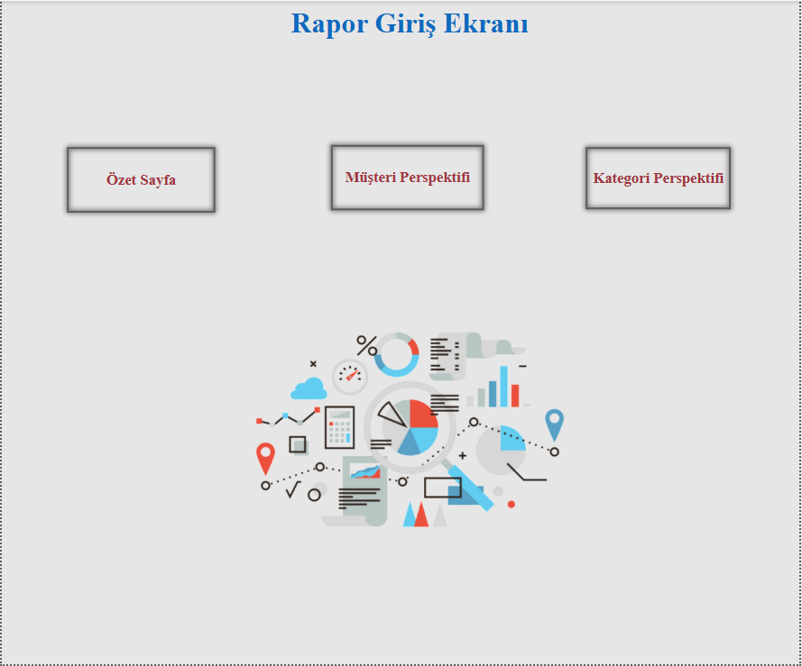
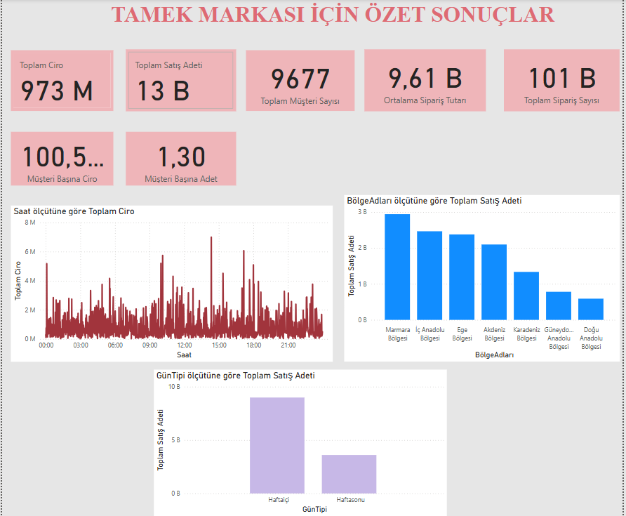
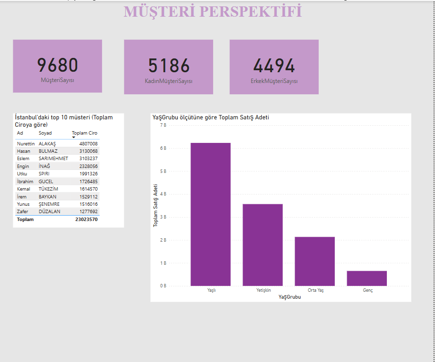
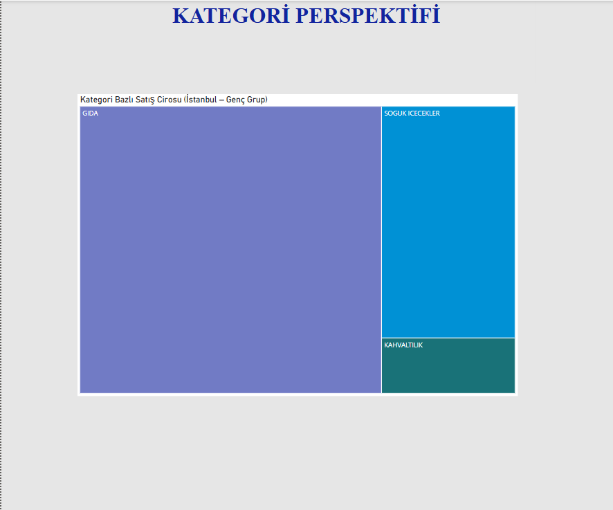

# PowerBi_Satis_Analizi_Projesi

# Proje Amacı
Bu proje, belirli bir marka özelinde satış verilerini farklı perspektiflerden analiz ederek anlamlı iş içgörülerine dönüştürmeyi amaçlamaktadır.
Power BI kullanılarak, veri modelleme, ölçüm hesaplama ve görselleştirme adımlarıyla zengin ve etkileşimli raporlar hazırlanmıştır.
Analizler; özet satış performansı, müşteri davranışları ve ürün kategorilerine göre detaylandırılmıştır.
Sonuçta, karar destek süreçlerini güçlendirecek, marka bazlı kolay anlaşılır ve kapsamlı bir raporlama çözümü sunulmuştur.

## Rapor Giriş Sayfası
Bu sayfadan diğer sayfalara yönlendirme butonları ile geçiş yapılabilir.

## Özet Sonuçlar
Sayfada yer alan özet göstergeler:

*Toplam Satış Adeti
*Toplam Ciro
-Toplam Müşteri Sayısı
-Toplam Sipariş Sayısı
-Müşteri Başına Ciro
-Müşteri Başına Adet
-Ortalama Sipariş Tutarı
-Haftasonu-Haftaiçi Satış Grafiği
-Saatlik Satış Tutarı Grafiği
-Bölgelere Göre Toplam Satış Adeti

## Müşteri Perspektifi
Bu sayfa, müşteri davranışlarını ve demografik özelliklerini analiz eder.

-Müşteri Sayısı
-Kadın ve Erkek Müşteri Sayısı
-İstanbul’daki Top 10 Müşteri(Toplam Ciro'ya göre)
-Yaş Grubuna Göre Satışlar

## Kategori Perspektifi
Bu sayfa, ürün kategorileri bazında satış performansını analiz eder.

-İstanbul’da yaşayan ve genç yaş grubunda yer alan müşterilerin
kategori bazında cirosu, ağaç haritası ile görselleştirilmiştir.

